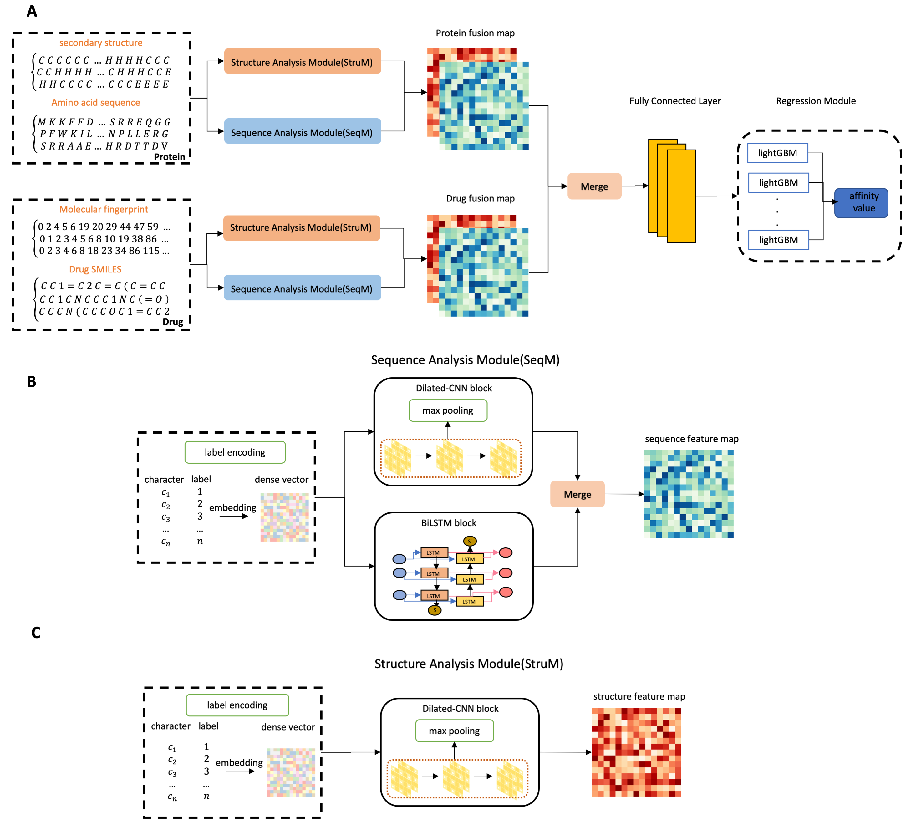

# README for DeepFusionDTA 
----
## Abstract

Identification of drug-target interaction (DTI) is the most important issue in the broad field of drug discovery. Using purely biological experiments to verify drug-target binding profiles takes lots of time and effort, so computational technologies for this task obviously have great benefits in reducing the drug search space. Most of computational methods to predict DTI are proposed to solve a binary classification problem, which ignores the influence of binding strength. Therefore, drug-target binding affinity prediction is still a challenging issue. Currently, lots of studies only extract sequence information that lacks feature-rich representation, but we consider more spatial features in order to fusion multi-source data in drug and target spaces. In this study, we propose a two-stage deep neural network ensemble model for detecting drug-target binding affinity, called DeepFusionDTA, via various information analysis modules. First stage is to utilize sequence and structure information to generate fusion feature map of candidate protein and
drug pair through various analysis modules based deep learning. Second stage is to apply bagging-based ensemble learning strategy for regression prediction, and we obtain outstanding results by combining the advantages of various algorithms in efficient feature abstraction and regression calculation. Importantly, we evaluate our novel method, DeepFusionDTA, which delivers 1.5% CI increase on KIBA dataset and 1.0% increase on Davis dataset, by comparing with existing prediction tools, DeepDTA. Furthermore, the ideas we have offered can be applied to in-silico screening of the interaction space, to provide novel DTIs which can be experimentally pursued.

## Network Architecture

----
## USAGE
### Required
- [tensorflow](1.15)
### Run

You can manually change the parameters in the go.sh file and execute './go.sh' for the first-stage training to extract efficient candidate protein and drug pair representation.Then run 'python bagging.py' to get the final prediction result.
The file *LGB_TestDenseFeature.py* is used to optimize the lightGBM model, and if you don't need to re-optimize, you can skip this step. Before use *LGB_TestDenseFeature.py* and *bagging.py*, you need to generate *test_Y.txt* , *train_Y.txt* and *DenseFeature.h5* by *generate_h5File.ipynb* to avoid using gpu and speed up the training.

----

